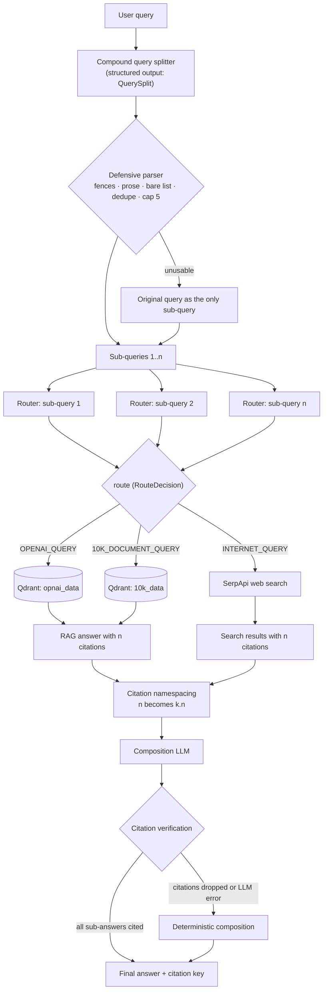
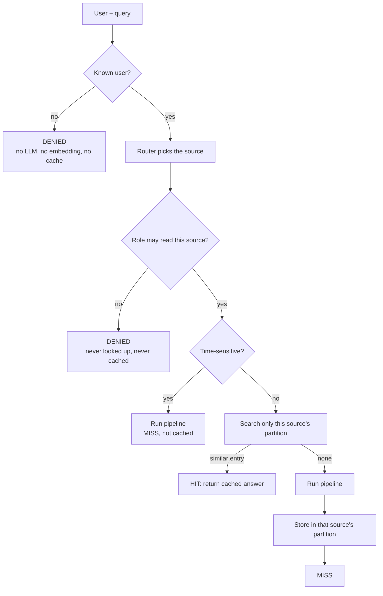

# Agentic Router

Sub-query division and an RBAC-aware semantic cache for the Agentic Router notebook
(Module 3, [multi-agent-course](https://github.com/hamzafarooq/multi-agent-course)).

## Overview

A plain RAG pipeline sends every question down the same path. An **agentic router** first
decides *where* the answer lives (OpenAI documentation, company 10-K filings, or the live web)
and only then retrieves and answers. This project extends the course router in two ways:

- **Sub-query division (required).** A compound question such as *"What was Uber's 2021 revenue
  and what are the newest LLMs?"* is split into independent sub-questions. Each is routed on its
  own, possibly to different sources, and the answers are merged into one response whose
  citations still point at the right sources.
- **RBAC-aware semantic cache (bonus).** Repeat questions are answered from a semantic cache
  without letting a cached answer cross a permission boundary: an engineer can never be served
  a finance analyst's cached 10-K answer, not even through a paraphrase.

Everything is built from scratch on the OpenAI SDK, Qdrant and SerpApi, with no agent framework.

## Architecture

### Query pipeline



In text form: User Query → Compound Query Splitter → Defensive Parser → Independent Router for
each sub-query → `OPENAI_QUERY` / `10K_DOCUMENT_QUERY` / `INTERNET_QUERY` → Retrieval / Web
Search → Citation Namespacing → Composition → Citation Verification → Final Answer.

A single question skips composition: one split call, then the usual route and answer calls.

### Secure semantic cache (bonus)



In text form: User + Role → Authorization Check → Source Selection → Semantic Cache →
MISS / HIT / DENIED → Retrieval if needed.

## Routes

| Route | Source | Method |
|---|---|---|
| `OPENAI_QUERY` | OpenAI documentation (Agents, tools, APIs) | Vector retrieval: Qdrant `opnai_data`, top 3 chunks → RAG answer |
| `10K_DOCUMENT_QUERY` | Financial 10-K filings (Uber 2021, Lyft 2022) | Vector retrieval: Qdrant `10k_data`, top 3 chunks → RAG answer |
| `INTERNET_QUERY` | Current or general information | Live web search: SerpApi (Google), top 5 results |

Embeddings come from `nomic-ai/nomic-embed-text-v1.5`, and the chat model is `gpt-5.6-luna`.

## Assignment Requirements

| Requirement | Implementation | Where demonstrated |
|---|---|---|
| Split compound questions | `split_query()` in `src/splitter.py`: structured `QuerySplit`, then the defensive parser | Notebook: Part 1 checks; Evaluation §1 (split accuracy) |
| Route each question independently | `answer_sub_query()` in `src/pipeline.py`: one router call per sub-query | Part 1 checks (one 📍 line per sub-query) |
| Support mixed routes | Each sub-query gets its own route and handler | Case 3; Evaluation §2 `mixed-route` and `3-part` |
| Combine final answer | `compose_answer()` in `src/composer.py` | Part 1 cases 2–3 |
| Preserve citations | `namespace_citations()` (`[n]` → `[k.n]`) and `missing_citations()` in `src/citations.py` | Evaluation §3; §2 "Citations Traceable" |
| Defensive JSON parsing | `extract_questions()` / `parse_route_decision()`: fences, prose, bare lists, alternative keys | Evaluation §2 parser robustness table |
| Malformed split fallback | Anything unusable becomes `[original query]` | Parser robustness: truncated, empty, `None`, API error |
| Single-query behavior | One sub-query means no composition call, answer returned as-is | Case 1; `test_single_query_no_extra_calls` |
| Concurrency (stretch) | `concurrent=True`: `asyncio.gather` + `asyncio.to_thread` | Stretch cell; Evaluation §4 benchmark |
| Factual accuracy (10-K) | Year-column instruction in the RAG prompt | Evaluation §6 spot-check |
| RBAC semantic cache (bonus) | `RoleAwareSemanticCache` (`src/cache.py`) + `secure_agentic_rag_cached()` | `run_self_check()`, `run_extra_checks()`, Evaluation §5 matrix |

## Required Examples

| # | Query | Expected |
|---|---|---|
| 1 | "What was Uber revenue in 2021?" | 1 sub-query → `10K_DOCUMENT_QUERY` |
| 2 | "What was Lyft revenue in 2021 and what was Uber revenue in 2021?" | 2 sub-queries → both `10K_DOCUMENT_QUERY` |
| 3 | "What was Uber's 2021 revenue and what are the newest LLMs?" | 2 sub-queries → `10K_DOCUMENT_QUERY` + `INTERNET_QUERY` |

All three run in the notebook's *Part 1 — checks* cells, and they are also in the routing
evaluation set.

## Evaluation Results

These numbers are from the committed notebook run, using live OpenAI and SerpApi calls on 2026-09-29.
LLM routing is not deterministic, so re-runs can differ slightly.

| Suite | Result |
|---|---|
| Routing accuracy (28 queries: OpenAI, 10-K, internet, ambiguous, compound) | **35/35 route decisions (100%)** |
| Split accuracy | **28/28 queries (100%)** |
| Mean split + route latency | 2.90 s per query |
| Live compound cases (same-route, mixed, 3-part, duplicate, 7 questions capped to 5) | 5/5, citations traceable in 3/3 full runs |
| Parser robustness (splitter + router, scripted bad output) | 20/20 |
| Citation tests | 10/10 |
| 10-K answer spot-check (Uber 2021, Lyft 2020/2021/2022; 3 runs each) | 4/4 questions correct in every run |
| Cache / RBAC matrix | 13/13 |
| `run_self_check()` / `run_extra_checks()` | both pass |
| Offline pytest suite | 13/13 |

**Concurrency benchmark** (4 compound queries, one run each, order alternated):

| Query | Sub-queries | Sequential | Concurrent | Speedup |
|---|---|---|---|---|
| Lyft 2021 revenue + Uber 2021 revenue | 2 | 7.52 s | 4.97 s | ×1.51 |
| Uber 2021 revenue + newest LLMs | 2 | 7.12 s | 6.72 s | ×1.06 |
| Guardrails + Lyft revenue + newest LLMs | 3 | 19.00 s | 10.74 s | ×1.77 |
| OpenAI embeddings + latest Super Bowl | 2 | 9.85 s | 7.67 s | ×1.28 |
| **Average** | | **10.87 s** | **7.53 s** | **×1.41** |

Concurrent execution was faster on all 4 queries. The split and the final composition stay
sequential, so the gain grows with the number of sub-queries, and it is largest for the 3-part
query. With one run per query these figures are indicative, not statistically robust: the
previous run measured ×1.22 on the same queries.

### RAG prompt fix (multi-year 10-K tables)

The evaluation originally checked routing, splitting, citations and access control, but not
whether an answer was factually right, and one wasn't. Lyft's 10-K shows 2022, 2021 and 2020
revenue side by side in one table, and the course's RAG prompt often reported the 2022 figure
($4.095B) as 2021 revenue (correct: $3.208B). One line was added to the RAG prompt telling the
model to match each figure to its year column. Measured on the same retrieved context:

| RAG prompt | Lyft 2021 | Lyft 2022 (control) | Uber 2021 (control) |
|---|---|---|---|
| Original | 3/8 correct (5/8 gave the 2022 figure) | 8/8 | 8/8 |
| + year-column instruction | **8/8** | 8/8 | 8/8 |

The notebook's 10-K spot-check (Evaluation §6) now guards against this regression. One
limitation remains: the internet route returns raw search snippets, so answers such as "newest
LLMs" are only as good as the top five Google results.

## Security / Cache

- **Authorization happens before protected cache access.** The order is identity → route →
  permission → cache → pipeline. A user never touches the cache for a source they can't read.
- **Unauthorized users receive `DENIED`.** Unknown users are rejected before any LLM call,
  embedding or cache lookup.
- **Denied requests are never inserted into the cache.** Error answers aren't cached either.
- **Time-sensitive queries bypass the cache.** Questions containing words like "latest", "today",
  "price" or "news" are always answered live. The check is deliberately over-broad: a false
  positive costs one cache miss.
- **Role changes take effect immediately.** Permissions are read at lookup time and nothing is
  stored per user, so when a user moves to another role, the old partitions simply stop being
  searched for them. No purge is needed.
- **Semantic matches cannot cross permission boundaries.** The cache is partitioned per knowledge
  source, and a lookup only searches partitions the caller's role may read, so a paraphrase can't
  match a forbidden entry. Writes are permission-scoped too: nobody can plant an answer in a
  partition they can't read.
- **Why per source, not per role:** both roles may read the OpenAI docs, so that answer is
  computed once and shared. Composite multi-source answers are never cached.

## Setup

**Python:** 3.10 or newer (tested on 3.10; Colab's default works).

**Dependencies:** `pip install -r requirements.txt`. `faiss-cpu` is optional: without it the
cache uses an exact NumPy search with the same results.

**Secrets:** never commit real keys. `.env` is gitignored.

| Variable | Used for | Get it |
|---|---|---|
| `OPENAI_API_KEY` | Splitting, routing, RAG answers, composition | https://platform.openai.com/api-keys |
| `SERP_API_KEY` | Live web search (`INTERNET_QUERY`) | https://serpapi.com/manage-api-key |
| `QDRANT_PATH` *(optional)* | Location of the prebuilt Qdrant data | see below |

### Qdrant data

The prebuilt collections (`opnai_data`, `10k_data`) ship with the course repo:

```bash
git clone --depth 1 https://github.com/hamzafarooq/multi-agent-course.git
# data: multi-agent-course/modules/Module_3_Production_Agentic_RAG_AI_Systems/Agentic_RAG/qdrant_data
```

Either set `QDRANT_PATH` to that folder, or copy `Agentic_RAG/qdrant_data` next to the notebook.
Qdrant runs in local (embedded) mode, so no server is needed.

### Run locally

```bash
git clone https://github.com/anuraglahon16/agentic-router-assignment.git
cd agentic-router-assignment
python -m venv .venv && source .venv/bin/activate
pip install -r requirements.txt jupyter
cp .env.example .env                  # then fill in OPENAI_API_KEY and SERP_API_KEY
export QDRANT_PATH=/path/to/multi-agent-course/modules/Module_3_Production_Agentic_RAG_AI_Systems/Agentic_RAG/qdrant_data
jupyter lab "001. Agentic Router.ipynb"    # start Jupyter from the repo root
```

On macOS, torch and faiss each bundle their own OpenMP runtime, and loading both crashes the
kernel. Start Jupyter with `KMP_DUPLICATE_LIB_OK=TRUE` set, or uninstall `faiss-cpu` to use the
NumPy fallback. Linux and Colab are unaffected.

### Run in Colab

Open the notebook in Colab and add `OPENAI_API_KEY` and `SERP_API_KEY` in the 🔑 Secrets panel,
with notebook access enabled. Then run all cells: the setup cells clone the course repo (for the
Qdrant data) and this repo (for `src/`).

### Offline tests (no keys needed)

```bash
python -m pytest -q
```

These tests use a scripted LLM and stub retrieval handlers to cover splitting and routing
fallbacks, citation namespacing, composition fallback, concurrency, and the RBAC cache
scenarios.

## Project layout

```
001. Agentic Router.ipynb   executable walkthrough + assignment + evaluation
src/
  auth.py         users, roles, permissions
  router.py       RouteDecision, router prompt, structured → parser → fallback
  splitter.py     QuerySplit, splitter prompt, defensive parser, dedupe, cap
  retrieval.py    dispatch to the notebook's retrieval / web-search handlers
  citations.py    [n] → [k.n], citation verification
  composer.py     LLM composition + deterministic fallback
  cache.py        RoleAwareSemanticCache (FAISS or NumPy), time-sensitivity
  pipeline.py     agentic_rag_multi(), secure_agentic_rag_cached(), audit log
  evaluation.py   evaluation datasets and suites
tests/test_offline.py
requirements.txt
```

The course's own retrieval code (embeddings, Qdrant search, RAG prompt, SerpApi tool) stays in
the notebook. Its only change is one added line in the RAG prompt, the year-column fix above. `src/` holds the assignment logic, which gets its clients and route
handlers passed in.
